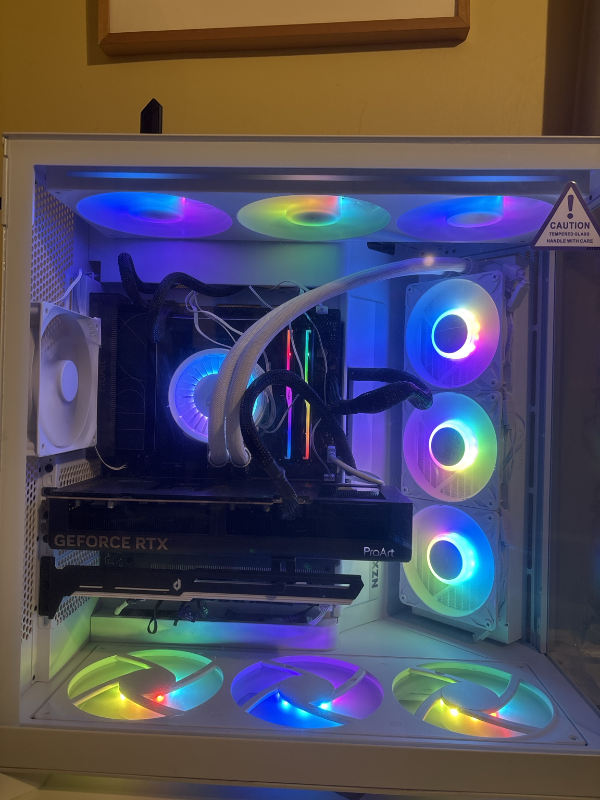

# ⚙️ Ship of Theseus | AI/HPC Research Node

<p align="center">
  
</p>

**Ship of Theseus** is my single-node AI/HPC research workstation and self-hosted engineering environment. It is both a physical machine and a record of a larger transition: from an abandoned plan to rebuild an early-2000s PC, to a fresh Electrical Engineering start, and ultimately to the AI Engineering path that now defines my independent work.

This repository documents the machine as infrastructure: the hardware, software stack, workloads, reproducibility practices, and evolution of the node that supports my early-career AI/ML systems and agentic-systems research.

Rather than treating a high-end workstation as a project by itself, the goal is to make the environment **inspectable, reproducible, benchmarkable, and useful as engineering infrastructure**.

## 🏛️ Why “Ship of Theseus”

The name predates the current workstation.

My original build idea was to take an **early-2000s PC** and progressively rebuild it into a modern system while preserving the identity of the original machine. After researching the platform, disassembling hardware, and working through what would actually need to be replaced, I reached the obvious Ship-of-Theseus problem: almost every meaningful component would have to change.

At that point, buying a complete modern case and building the system properly from the ground up made more engineering sense than preserving the old chassis for its own sake.

That physical rebuild ended up mirroring a larger change in direction.

I originally assembled this system as part of a fresh start in **Electrical Engineering at Texas State University**. After a difficult start there—particularly administrative friction that made the path a poor fit—I reconsidered what work I was actually most motivated to pursue. The answer was not traditional EE by itself. It was the intersection I had already been gravitating toward: **AI, machine learning, high-performance systems, agentic software, and brain-inspired computing**.

I am now pursuing **AI Engineering at Western Governors University (WGU)**, and Ship of Theseus has become the primary local research node behind that new direction.

So the name now works at several levels:

- the original early-2000s-PC rebuild concept;
- the modern workstation that replaced that plan;
- the continuous replacement and refinement of the machine itself;
- and the transition from one engineering path into a more focused AI/ML systems trajectory.

The system changed. The purpose became clearer.

## 🎯 What this node is for

Ship of Theseus is used as a local execution and validation platform for work spanning:

- **AI/ML systems engineering** — local model experimentation, fine-tuning workflows, inference, evaluation, and synthetic-data pipelines.
- **Agentic systems** — coding-agent workflows, repository-scale experiments, multi-agent engineering processes, automated review, and trajectory generation.
- **GPU computing** — CUDA/CUDA-adjacent experimentation, profiling, kernel validation, and Blackwell-specific performance work.
- **Neuromorphic computing** — spiking-neural-network simulation, hybrid ANN/SNN experiments, telemetry-driven research, and model conversion workflows.
- **FPGA / RTL development** — SystemVerilog simulation and self-hosted validation for hardware-oriented projects.
- **Self-hosted CI** — GitHub Actions workloads that benefit from access to the workstation's GPU, Linux environment, or locally installed engineering toolchains.

This machine is especially important to my **early-career independent portfolio** because it gives me a real environment in which to build, test, measure, fail, iterate, and produce artifacts that go beyond coursework.

## 🖥️ Node architecture

### Core compute

| Component | Specification | Primary role |
| :--- | :--- | :--- |
| **CPU** | AMD Ryzen 9 9950X, 16 cores | Compilation, simulation, data processing, and multi-process agent workloads |
| **GPU** | ASUS ProArt GeForce RTX 5080 OC, 16 GB VRAM | Local ML, CUDA experimentation, and GPU-accelerated research |
| **Motherboard** | ASUS ProArt X870E-CREATOR WIFI | AM5 workstation platform, PCIe 5.0 expansion, multi-M.2 storage, and high-bandwidth connectivity |
| **Memory** | 64 GB total: 2 × 32 GB G.SKILL Trident Z5 Neo RGB, DDR5-6000, CL30-40-40-96, AMD EXPO | Dataset processing, parallel development workloads, simulation, and local model work |
| **Primary storage** | 2 TB Crucial T700 PCIe 5.0 NVMe | High-throughput working storage for models, build artifacts, and experiment data |
| **Secondary / backup storage** | 2 TB Fanxiang PCIe 4.0 NVMe SSD | Secondary workspace, overflow storage, backups, and staging |
| **Operating system** | Fedora Linux | Primary research, development, automation, and self-hosted CI environment |

The memory kit is G.SKILL `F5-6000J3040G32GX2-TZ5NR`: 64 GB total, 32 GB × 2, DDR5-6000, CL30-40-40-96, 1.40 V, with AMD EXPO.

### Power, cooling, and airflow

| Component | Specification | Operational role |
| :--- | :--- | :--- |
| **Power supply** | be quiet! Straight Power 12, 1500 W, ATX 3.0 / PCIe 5.0, 80+ Platinum | Stable power delivery and headroom for sustained GPU workloads and future expansion |
| **CPU cooler** | ARCTIC Liquid Freezer III Pro 360 A-RGB, white | Sustained CPU thermals during long compilations, simulations, and data processing runs |
| **Top airflow** | NZXT F420 RGB Core, white, 420 mm single-frame RGB fan unit | Top exhaust |
| **Bottom airflow** | NZXT F420 RGB Core, white, 420 mm single-frame RGB fan unit, reverse-blade orientation | Bottom intake |

The top and bottom fan units use the same NZXT F420 RGB Core model. This layout supports sustained compute while keeping the physical node easy to inspect and evolve.

### Workstation peripherals

| Component | Specification |
| :--- | :--- |
| **Keyboard** | ASUS ROG Strix Scope II 96 Wireless |
| **Mouse** | ASUS ROG Spatha X Wireless |

The machine is intentionally treated as an evolving research node rather than a fixed build. Hardware, drivers, runtimes, and research workloads may change over time—the name **Ship of Theseus** reflects that continuous replacement and refinement.

## 🔬 Research ecosystem

This node supports multiple repositories and experimental pipelines across my GitHub and Hugging Face work. Representative workload classes include:

### Synthetic-data and model-training infrastructure

Repository-scale agent trajectories, validation artifacts, synthetic software-engineering data, and downstream local training/evaluation workflows.

### Agentic systems engineering

Coding-agent orchestration, issue-to-PR workflows, review loops, repository-scale automation, tool-use experiments, and engineering-trajectory capture for later evaluation or training.

### Neuromorphic and hybrid AI systems

Spiking neural networks, MoE-to-SNN experimentation, quantization, neural telemetry, sparse computation, and hardware/software co-design.

### GPU and systems work

Rust/Linux systems programming, CUDA-focused experimentation, profiling, reproducibility testing, and performance-sensitive infrastructure.

### RTL and FPGA validation

SystemVerilog simulation and hardware-oriented CI workloads, including workflows that are impractical or impossible on ordinary hosted runners because they depend on local engineering toolchains.

## 🧪 Repository direction

This repository is the **infrastructure record** for the node. As the environment matures, the highest-value additions are:

- reproducible Fedora/bootstrap documentation;
- NVIDIA driver, CUDA, and ML-runtime verification;
- system inventory and health-report scripts;
- GPU/CPU/storage benchmark snapshots;
- self-hosted GitHub Actions runner documentation;
- systemd/service configuration used by research workloads;
- experiment-environment provenance and reproducibility notes;
- documented failure modes, upgrades, and migration history.

The reproducible-node baseline is documented in [`docs/node-baseline.md`](docs/node-baseline.md), with companion runbooks for [`self-hosted-runner.md`](docs/self-hosted-runner.md), [`backup-recovery.md`](docs/backup-recovery.md), and [`workload-catalog.md`](docs/workload-catalog.md). Runtime inventory, verification, benchmark, and telemetry collectors live under `scripts/`; they produce timestamped evidence without embedding machine-specific results in the README.

The canonical sanitized execution-environment artifact is documented in [`docs/system-report.md`](docs/system-report.md). It uses a versioned schema and intentionally excludes raw inventory and identifying host details.

The repository should stay narrow: application-specific code belongs in its own project. Ship-of-Theseus-Workstation documents the **platform those projects run on**.

## 📐 Engineering principles

1. **Reproducibility over screenshots.** Record enough configuration to explain and recreate an environment.
2. **Measured performance over component marketing.** Benchmarks and workload behavior matter more than hardware specifications alone.
3. **Infrastructure as an engineering artifact.** CI, drivers, runtimes, services, and observability deserve versioned documentation.
4. **Project isolation.** Research code remains in its canonical repository; this repo owns node-level concerns.
5. **Evolution is expected.** Changes to the machine should leave an auditable trail instead of silently replacing the previous state.
6. **Independent work should create evidence.** The node exists to produce reproducible experiments, engineering artifacts, datasets, benchmarks, and validated systems—not merely to host tools.

## 🗺️ Planned structure

```text
Ship-of-Theseus-Workstation/
├── README.md
├── assets/
├── docs/          # baseline, GPU stack, CI, recovery, reproducibility
├── scripts/       # verification, inventory, benchmarks, telemetry
├── configs/       # node-level provenance and service/tool configuration
└── benchmarks/    # reproducible performance snapshots and results
```

These directories represent the intended infrastructure layout and will be added as their contents become useful and reproducible.

## 🤖 AI collaboration attribution

The August 2026 repositioning of this repository—from a general workstation/portfolio page into a focused AI/HPC infrastructure record—was developed collaboratively with **GPT-5.6 Sol, GPT-5.6 Luna, and GPT-5.6 Terra by OpenAI**. GPT-5.6 Sol, GPT-5.6 Luna, and GPT-5.6 Terra contributed repository-scope analysis, information architecture, README drafting/refinement, and integration of the project's origin story into the current infrastructure narrative; final project direction and repository ownership remain with **rmems**.

The sanitized system-report tool (`scripts/theseus-report`, #13) was architected and implemented by **GPT-5.6 Terra by OpenAI**; its post-review security and correctness hardening—command timeouts and locale-stable parsing, per-collector schema completeness, CI credential/action pinning, and NaN-safe JSON handling—was implemented by **Claude Sonnet 5 by Anthropic**.

AI-assisted contributions are attributed explicitly when they materially shape repository documentation or engineering decisions.

## 📄 License and third-party tools

Original scripts and documentation are available under the [MIT License](LICENSE). Workstation photographs and other visual assets are excluded; see [assets licensing](assets/LICENSE.md). The collectors invoke, but do not vendor, external tooling; its attribution and upstream licensing are documented in [THIRD_PARTY_NOTICES.md](THIRD_PARTY_NOTICES.md).

---

**Status:** Active research infrastructure for independent AI/ML systems, agentic systems, neuromorphic computing, GPU experimentation, and self-hosted engineering workflows.
